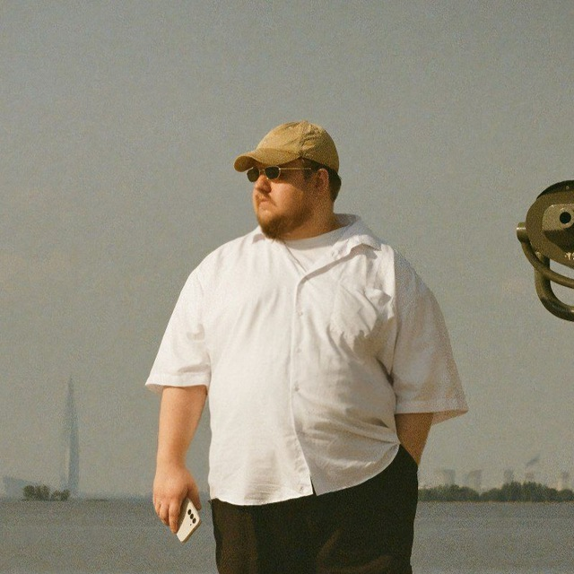
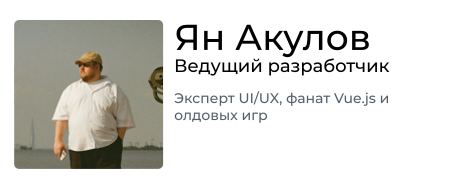

# Shark-Flow — design and development studio

> Чтобы посмотреть версию на русском, нажмите [сюда](./readme.md)

## Team

  

    
  

  

    

      Yan Akulov
    

    

      Lead Developer
    

    

      UI/UX expert, Vue fan.js and old-fashioned games
    

  

## Our projects

## Contact Information

For any questions or inquiries, please contact us at: design@yschafer.ru
